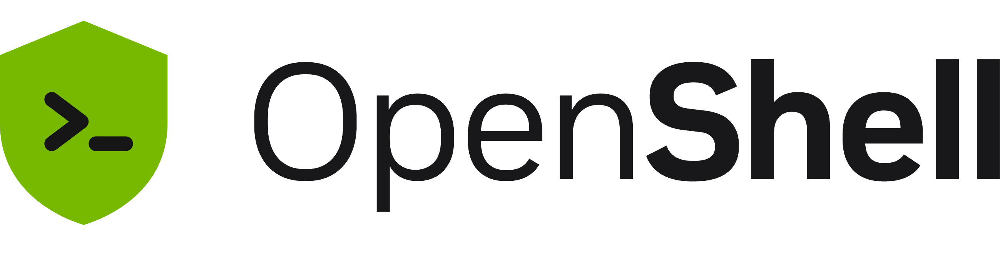

<!-- markdownlint-disable MD033 MD041 -->

<picture>
  <source media="(prefers-color-scheme: dark)" srcset="docs/brand/assets/openshell-banner-dark.png">
  <source media="(prefers-color-scheme: light)" srcset="docs/brand/assets/openshell-banner-light.png">
  
</picture>

<!-- markdownlint-enable MD033 MD041 -->

[](https://github.com/NVIDIA/OpenShell/blob/main/LICENSE)
[](https://pypi.org/project/openshell/)
[](SECURITY.md)
[](https://docs.nvidia.com/openshell/latest/index.html)

> [!IMPORTANT]
> **New in OpenShell 0.1.0:** a stable release cadence, new isolation primitives, an expanded extension surface, and new APIs. [Read the 0.1.0 upgrade guide](https://docs.nvidia.com/openshell/latest/upgrade/0-1-0).

OpenShell is the safe, private runtime for fleets of autonomous AI agents. Agents are most useful when they can read files, install packages, call APIs, and use credentials. OpenShell gives them that capability without giving them unrestricted access to your data, secrets, or network. You declare what each agent can touch in a policy, and OpenShell enforces it.

## How It Works

OpenShell governs what agents can do in two ways: it instruments the kernel to enforce policy on every file access, system call, and network connection at runtime, and it uses formal verification to check what a policy change would allow before it is applied.

- **Kernel-level enforcement.** Each agent runs in an isolated sandbox. Kernel controls confine which files it can access and which system calls it can make, and every network connection passes through a policy check before it leaves the sandbox. Agents never see real credentials; OpenShell adds them only to requests bound for approved endpoints.
- **Formally verified policy changes.** Before a policy change is approved, OpenShell uses formal verification to flag risky new access it would grant, such as reaching a new host with credentials or calling a new API method, so those changes wait for human review.

See [Architecture](https://docs.nvidia.com/openshell/latest/about/architecture) for how the gateway, supervisor, and sandbox fit together.

## Quickstart

You need Linux, macOS on Apple Silicon, or Windows with WSL 2 (experimental), plus Docker, Podman, or host virtualization. See the [Support Matrix](https://docs.nvidia.com/openshell/latest/about/support-matrix) for details.

```shell
curl -LsSf https://raw.githubusercontent.com/NVIDIA/OpenShell/main/install.sh | sh
openshell sandbox create --name demo
```

The installer sets up the CLI and a local gateway. The default sandbox image is minimal Ubuntu with no agent installed. To run a real agent, follow [Run Your First Agent](https://docs.nvidia.com/openshell/latest/about/run-your-first-agent): it runs OpenCode against a free OpenRouter model and shows how to approve new access as the agent needs it.

## Explore Further

- [Sandboxes](https://docs.nvidia.com/openshell/latest/how-it-works/sandboxes/overview): images, runtimes, GPUs, and lifecycle.
- [Policies](https://docs.nvidia.com/openshell/latest/how-it-works/policies/overview): filesystem, network, and process rules, with the [advisor](https://docs.nvidia.com/openshell/latest/how-it-works/policies/advisor) and [prover](https://docs.nvidia.com/openshell/latest/how-it-works/policies/prover) for reviewing changes.
- [Providers](https://docs.nvidia.com/openshell/latest/how-it-works/providers/overview): credentials that work only at approved endpoints, including [inference](https://docs.nvidia.com/openshell/latest/how-it-works/inference).
- [Gateways](https://docs.nvidia.com/openshell/latest/how-it-works/gateways/overview): the control plane for sandboxes, policy, and access.
- [Kubernetes](https://docs.nvidia.com/openshell/latest/kubernetes/setup): deploy the gateway with Helm. Your CNI must enforce `NetworkPolicy`.
- [Extensibility](https://docs.nvidia.com/openshell/latest/extensibility/overview): middleware, interceptors, and compute drivers.
- [Tutorials](https://docs.nvidia.com/openshell/latest/tutorials/first-network-policy): step-by-step policy and agent walkthroughs.
- [Prerelease and development builds](https://docs.nvidia.com/openshell/latest/about/installation#prerelease-and-development-builds): try an upcoming release or the latest commit on `main`.

## Agent Skills

Install the public OpenShell skills for your coding agent:

```shell
npx skills add NVIDIA/OpenShell
```

The skills teach your agent to drive the OpenShell CLI, write sandbox policies, and debug gateways and inference routing. They live in [`skills/`](skills/) and work without an OpenShell source checkout.

## SDKs

SDKs connect applications to an OpenShell gateway. They do not install the CLI. Use the same OpenShell release for the SDK and the gateway when possible.

| Language | Install | Docs |
|---|---|---|
| Python | `uv add openshell` | [README](python/openshell/) |
| TypeScript | `npm install @nvidia/openshell-sdk` (GitHub Packages) | [README](sdk/typescript/README.md) |
| Go | `go get github.com/NVIDIA/OpenShell/sdk/go@latest` | [README](sdk/go/README.md) |
| Rust | Git dependency pinned to a release tag | [README](crates/openshell-sdk/README.md) |

## Community

- **Questions and discussion:** [GitHub Discussions](https://github.com/NVIDIA/OpenShell/discussions)
- **Bug reports and feature requests:** [GitHub Issues](https://github.com/NVIDIA/OpenShell/issues), using the issue templates
- **Security vulnerabilities:** follow [SECURITY.md](SECURITY.md). Do not open a GitHub issue.
- **Roadmap:** [OpenShell Roadmap](https://github.com/orgs/NVIDIA/projects/233) and the [RFC board](https://github.com/orgs/NVIDIA/projects/233/views/6)
- **Try it in the cloud:** [Brev Launchable](https://brev.nvidia.com/launchable/deploy/now?launchableID=env-3Ap3tL55zq4a8kew1AuW0FpSLsg)

OpenShell is built agent-first: it is developed with the same agent-driven workflows it enables. See [CONTRIBUTING.md](CONTRIBUTING.md) for development setup and the contribution workflow, and [AGENTS.md](AGENTS.md) for the contributor agent skills and workflow chains.

## Telemetry

OpenShell collects anonymous telemetry, limited to operational categories and counts, to help improve the project. It does not collect sandbox names, hostnames, file paths, prompts, credentials, provider or model names, or user content. To disable it, set `OPENSHELL_TELEMETRY_ENABLED=false` on the gateway, or `server.telemetryEnabled=false` for Helm installs. You can also compile telemetry out entirely. See [Telemetry](https://docs.nvidia.com/openshell/latest/observability/telemetry) for details and the [community telemetry reports](telemetry/README.md) for published usage trends.

## Notice and Disclaimer

This software automatically retrieves, accesses or interacts with external materials. Those retrieved materials are not distributed with this software and are governed solely by separate terms, conditions and licenses. You are solely responsible for finding, reviewing and complying with all applicable terms, conditions, and licenses, and for verifying the security, integrity and suitability of any retrieved materials for your specific use case. This software is provided "AS IS", without warranty of any kind. The author makes no representations or warranties regarding any retrieved materials, and assumes no liability for any losses, damages, liabilities or legal consequences from your use or inability to use this software or any retrieved materials. Use this software and the retrieved materials at your own risk.

## License

This project is licensed under the [Apache License 2.0](https://github.com/NVIDIA/OpenShell/blob/main/LICENSE).
