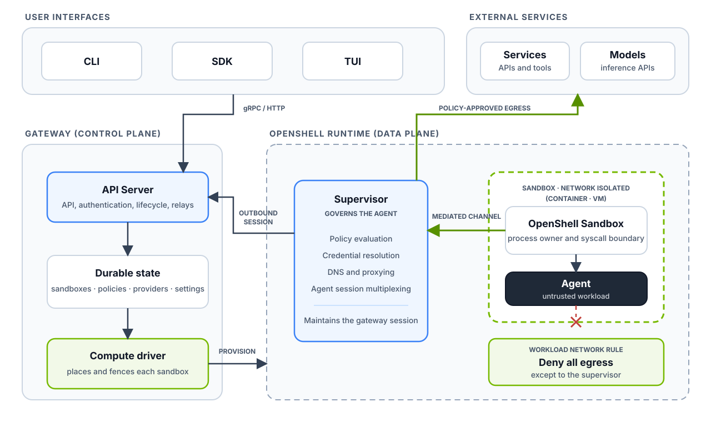
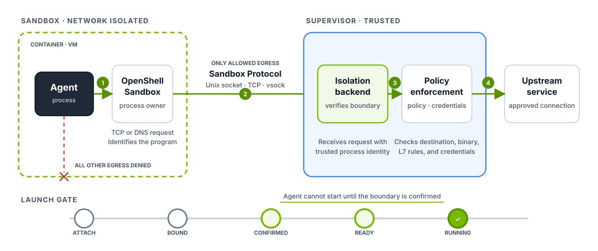

OpenShell separates control-plane state from sandbox enforcement. The gateway
owns sandbox state, policy, providers, and access, and uses formal verification
to evaluate proposed policy changes before they are approved. A compute driver
provisions the workload and its isolation boundary.

The trusted supervisor runs outside the workload. `openshell-sandbox` runs
inside it, owns the agent process, and mediates its network requests. All other
workload egress is denied. The supervisor initiates one connection to the
gateway for configuration, credentials, logs, and interactive sessions.

## What Each Piece Does

| Component | What it does |
|---|---|
| [Gateway](/how-it-works/gateways/overview) | Checks who you are and remembers everything about your sandboxes. It delivers policy and settings, attaches providers, decides who can do what, and coordinates connections into sandboxes. |
| [Compute runtime](/how-it-works/sandboxes/runtimes) | Creates the sandbox, starts the supervisor and the workload, sets up the private channel between them, and builds the network fence. It reports status back and cleans up when the sandbox goes away. |
| [Supervisor](#inside-the-sandbox-boundary) | Lives on the trusted side of the boundary. It checks requests against policy, supplies credentials, resolves DNS, opens approved connections, and keeps the link to the gateway alive. It works with every runtime through one [isolation backend](/extensibility/isolation-backends) interface to confirm the boundary, start the agent, run commands, forward connections, and see network requests. |
| [OpenShell Sandbox](#inside-the-sandbox-boundary) | Lives inside the boundary with the agent. It owns the agent's processes, knows which program made each request, applies process controls, and forwards TCP and DNS traffic to the supervisor. |
| [Outer network fence](/security/best-practices#deny-by-default-egress) | Denies all network egress from the workload except its protected connection to the supervisor. Each runtime builds this with its own native tools. |
| [Policy prover](/how-it-works/policies/prover) | Runs in the gateway and uses formal verification to check each proposed policy change before approval. It flags changes such as new credentialed reach, new HTTP methods, or access to cloud metadata endpoints, and any finding blocks auto-approval. It also ships as the standalone `openshell-prover` command for checking a policy against a boundary in CI. |
| [Policies](/how-it-works/policies/overview) | Describe what the agent can touch: files, processes, network destinations, API calls, and where provider credentials can go. |
| [Providers](/how-it-works/providers/overview) | Connect a service name to a stored credential. The supervisor hands that credential out only where policy allows it. |

## Inside the Sandbox Boundary

The supervisor and `openshell-sandbox` sit on opposite sides of the boundary.
The supervisor is trusted and makes the decisions. `openshell-sandbox` shares
the boundary with the untrusted agent, so it never makes policy decisions. It
reports what the agent is trying to do and lets the supervisor decide.

`openshell-sandbox` launches the agent as an owned child and provides exec,
terminal streams, signals, process status, and loopback forwarding. In the
current Linux backend, the workload uses one non-root identity and no Linux
capabilities. Landlock limits filesystem access; seccomp user notification
stages network operations. The sandbox identifies the calling executable from
trusted process observations.



### The protected channel

The supervisor and `openshell-sandbox` talk over the OpenShell Sandbox Protocol:
one mutually authenticated HTTP/2 connection that carries many independent
streams. The compute driver picks the transport: a Unix socket for Docker and
Podman, TCP for Kubernetes, or vsock for MicroVM. Authentication and protocol
behavior are the same on all of them. The supervisor presents a
sandbox-specific credential, as described in
[How Components Authenticate](#how-components-authenticate).


Each TCP connection gets its own stream with its own backpressure, so a slow
download can't block DNS, exec, or process control.

| Guarantee | How `openshell-sandbox` provides it | What the supervisor gets |
|---|---|---|
| Process ownership | Runs the agent as an owned child and keeps its process and terminal state. | Handles to wait on, attach to, signal, exec in, and stop the agent. |
| Program identity | Identifies the calling program from trusted `/proc` data. | The real program behind each request, not a path the agent claims. |
| Network mediation | Intercepts TCP opens and DNS queries with seccomp and hands them over. | Requests that wait for a policy decision before going anywhere. |
| Fail closed | Holds launch until the supervisor confirms, and freezes the agent if the connection drops. | A short window to reconnect, or a stopped workload. |

Together these mean the agent can't run before its controls are confirmed,
signals and exec reach only this sandbox's processes, and the agent can't get
around TCP or DNS mediation.

### Starting an agent safely

The supervisor's `OpenShellRuntimeBackend` implements the shared
[Isolation Backend](/extensibility/isolation-backends) interface using the
Sandbox Protocol. Before the agent runs, it walks through a fixed series of
steps:

```text
Attach → Bound → Confirmed → Ready → Running
```

The compute driver supplies the transport and a runtime descriptor. The backend
binds that descriptor to the admitted sandbox during attach, then confirms the
workload identity, launch controls, and outer network fence before starting the
agent. Each step must succeed before the next one begins. A stale or mismatched
boundary cannot launch the workload.

### How a network request travels

Say the agent tries to call an API. Here's what happens, and it works the same
way on every runtime:

1. The agent opens a TCP connection or makes a DNS lookup.
2. `openshell-sandbox` notes which program made the request.
3. The request travels over the Sandbox Protocol to the supervisor.
4. The supervisor checks the request against policy and adds any credentials the
   policy allows.
5. If the request is allowed, the supervisor opens the real connection and
   relays the traffic.

The protected channel to the supervisor is the only network path allowed out of
the workload boundary. The outer fence denies all other network egress. The
agent cannot reach an external service, the gateway, DNS, or another private
address directly.

## How Each Runtime Builds the Boundary

Every runtime follows the same contract, but each one uses the tools it already
has to place the supervisor, connect it to the sandbox, and fence off the
network.

| Runtime | Where the supervisor runs | How it talks to the sandbox | How direct egress is blocked |
|---|---|---|---|
| Docker | Its own container | Authenticated Unix socket on a driver-owned volume | Workload container has networking turned off |
| Podman | Its own container | Authenticated Unix socket on a driver-owned volume | Workload container has networking turned off |
| Kubernetes | Its own pod | Private service with mutual TLS | NetworkPolicy allows only the supervisor service |
| VM | A process on the host | Authenticated vsock | Guest has no network device |

The runtime's job is to build the boundary and prove it's in place. It never
decides whether a request is allowed. That decision always belongs to the shared
supervisor and policy engine, which is why the same policy behaves the same way
everywhere.

Runtimes can differ in how they report readiness and which features they
support. Each one advertises its capabilities so the gateway knows what it can
do.

## How Components Authenticate

Three connections tie a sandbox together. The gateway is the only component
that signs credentials, and every credential names exactly one sandbox.


| Connection | Who connects | How it's protected |
|---|---|---|
| Supervisor to gateway | The supervisor dials out to the gateway. | A gateway JWT, over TLS when the gateway has TLS enabled. |
| Supervisor to `openshell-sandbox` | The supervisor dials into the workload over the driver's private channel. | Mutual TLS, plus a sandbox JWT. |
| Agent to supervisor | The agent never connects directly. `openshell-sandbox` relays its traffic over the connection above. | Covered by the supervisor-to-sandbox channel. |

### Getting the first credential

The supervisor needs a starting credential to prove which sandbox it belongs
to. How it gets one depends on the runtime:

- **Docker, Podman, and MicroVM.** The driver hands the supervisor its initial
  tokens directly, in files only the supervisor can read.
- **Kubernetes.** The supervisor presents its pod's ServiceAccount token. The
  gateway asks the Kubernetes driver to verify the token and confirm that the
  pod belongs to the expected sandbox before it issues any JWTs.

Either way, the gateway checks the claim against its own record of the sandbox
before returning credentials.

### Two JWTs, two jobs

The gateway issues a pair of JWTs for each run of a sandbox:

- **Gateway JWT.** Sent with every supervisor call to the gateway. It allows
  only the calls a supervisor needs, such as fetching policy, pushing logs, and
  relaying sessions. It is not a user credential and can't manage other
  sandboxes.
- **Sandbox JWT.** Sent with every supervisor call to `openshell-sandbox`.
  `openshell-sandbox` holds only the gateway's public key, so it can verify the
  token but can never create one.

Each token works only on its own connection. Both are bound to one sandbox and
one run of that sandbox, called a generation. Restarting a sandbox starts a new
generation with fresh tokens and fresh TLS certificates, and the old ones stop
working.

### Renewing and revoking

The supervisor keeps its tokens in memory and renews both together before they
expire. Renewal works only while the sandbox still exists, so deleting a
sandbox cuts off its supervisor.

Shared deployments, such as Kubernetes, should set `gateway_jwt.ttl_secs` so
tokens expire. Local single-user gateways can leave it unset, which issues
tokens that last for the life of the sandbox run.

### What the agent can see

The agent shares its side of the boundary with `openshell-sandbox`, so
`openshell-sandbox` holds nothing worth stealing: no gateway signing key, no
gateway JWT, and no provider credentials. It can verify that it's talking to
the right supervisor, but it can't impersonate one.

If the supervisor disconnects, `openshell-sandbox` freezes the agent. Only the
same supervisor process can reconnect and resume it. A new supervisor can't
take over a running sandbox, even with valid credentials.

## Working With Your Existing Infrastructure

OpenShell plugs into the tools you already use, including container runtimes,
schedulers, secret stores, identity providers, image pipelines, storage, and
device plugins. The gateway and supervisor define how OpenShell behaves.
Drivers translate that behavior into whatever your platform understands and
report back what happened. This keeps platform-specific details out of the core
control plane and the policy model.
