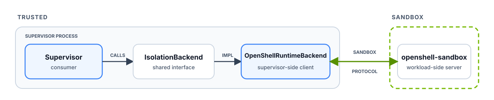

The supervisor uses one Rust interface, `IsolationBackend`, to launch and
control the agent workload. `OpenShellRuntimeBackend` implements that interface
by calling `openshell-sandbox` over the OpenShell Sandbox Protocol. Because the
supervisor depends only on the interface, another backend can provide the same
operations with different isolation mechanisms without changing the gateway API
or policy model.

## The Interface

Each step returns a new type, so the supervisor can't start an agent on a
boundary that hasn't been confirmed. The traits are defined in
[`contract.rs`](https://github.com/NVIDIA/OpenShell/blob/main/crates/openshell-isolation-interface/src/contract.rs)
in the
[`openshell-isolation-interface`](https://github.com/NVIDIA/OpenShell/tree/main/crates/openshell-isolation-interface)
crate. `OpenShellRuntimeBackend` is implemented in
[`openshell-sandbox-backend`](https://github.com/NVIDIA/OpenShell/tree/main/crates/openshell-sandbox-backend).

| Rust surface | What it does | Returns |
|---|---|---|
| `IsolationBackend::attach()` | Binds a verified runtime descriptor to one admitted sandbox. | `BoundBoundary` |
| `BoundBoundary::confirm()` | Checks the workload's controls before any agent code runs. | `ConfirmedBoundary` |
| `ReadyBoundary::start_agent()` | Rechecks launch controls and starts the agent. | `RunningBoundary` |
| `RunningBoundary::agent()` | Waits for, signals, attaches to, or stops the agent process. | `BoundaryProcess` |
| `RunningBoundary::exec()` | Starts exec and terminal sessions inside the same boundary. | `BoundaryExec` |
| `RunningBoundary::loopback_connector()` | Reaches a loopback service inside the workload for forwarding. | `BoundaryLoopbackConnector` |
| `BoundBoundary::network_mediation_source()` | Receives TCP opens and DNS queries tagged with the calling program. | `NetworkMediationSource` |

## Who Owns What

| Component | Owns |
|---|---|
| Supervisor | Policy decisions. Policy, credentials, DNS resolution, and approved external connections stay outside the agent workload. |
| Compute driver | Placement and fencing. The driver creates runtime resources, installs the outer egress fence, and supplies a verified descriptor. |
| Isolation backend | Common behavior. The backend turns the shared Rust calls into a protected session with the sandbox runtime. |

For how `openshell-sandbox` enforces the boundary, refer to
[Sandbox](/about/architecture/sandbox). For driver-specific workload behavior,
refer to [Runtimes](/how-it-works/sandboxes/runtimes).
