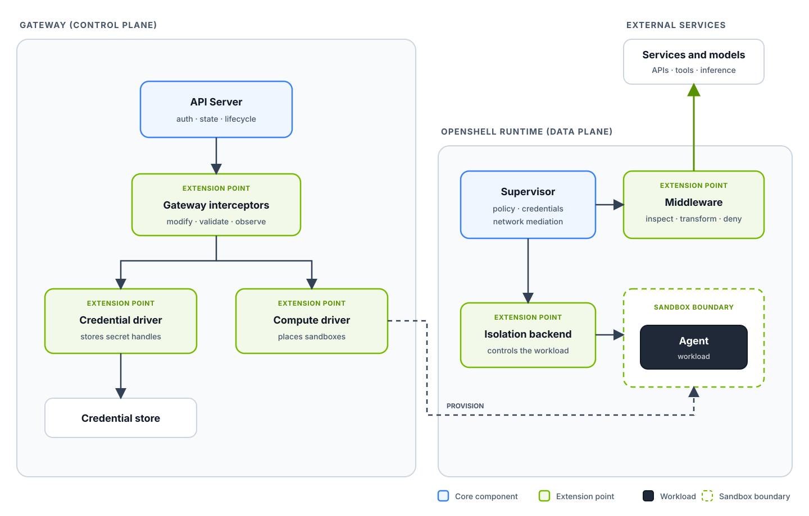

Extensibility sits at the core of OpenShell. OpenShell is designed to run
everywhere and adapt to the infrastructure, governance, and workload
requirements of each deployment. Its extension points add deployment-specific
behavior while preserving the same API, policy model, and security boundaries.

## Extension Points

### [Middleware](/extensibility/supervisor-middleware)

Supervisor middleware inspects, transforms, or denies allowed HTTP and
WebSocket traffic. It runs after policy evaluation and before OpenShell injects
provider credentials, so deployments can add content controls and auditing
without exposing managed secrets.

### [Gateway Interceptors](/extensibility/gateway-interceptors)

Gateway interceptors add governance to selected control-plane operations. They
can modify or validate proposed API writes and observe successful changes while
the gateway retains authentication, persistence, and final validation.

### [Drivers](/extensibility/drivers)

Compute drivers place and manage sandboxes on deployment-specific runtimes.
Credential drivers connect provider records to the deployment's secret store.
Together, they adapt OpenShell to the infrastructure it runs on.

### [Isolation Backends](/extensibility/isolation-backends)

Isolation backends connect the supervisor to the sandbox runtime. They provide
a consistent contract for process launch, terminal streams, signals, status,
and runtime-specific isolation inside the provisioned workload.

## Authentication

When the gateway has JWT signing configured, OpenShell sends a short-lived bearer token with every call to a [gateway interceptor](/extensibility/gateway-interceptors) or [supervisor middleware](/extensibility/supervisor-middleware) service. Validate it to confirm the call comes from your gateway or one of its sandboxes.

| Claim | Value |
|---|---|
| `iss` | `openshell-gateway:<gateway_id>` |
| `aud` | The registration's `audience`. Defaults to `urn:openshell:extension:interceptor:<name>` or `urn:openshell:extension:middleware:<name>`. |
| `caller_kind` | `gateway`, or `supervisor` for middleware calls from a sandbox. |
| `sandbox_id` | The calling sandbox, when `caller_kind` is `supervisor`. |

### Validate Each Token

Get the gateway ID and public signing key (or JWKS) from the gateway operator and configure them in your service. Don't trust a key discovered from an unverified source. To pick up rotated keys, fetch `/.well-known/openid-configuration` from the gateway over TLS and follow its `jwks_uri`.

For each request, check that:

- `typ` is `openshell-ext+jwt` and `alg` is `EdDSA`. Pin the algorithm; don't read it from the token.
- The signature, expiry, and exact audience are valid.
- `iss` is `openshell-gateway:<gateway_id>`, not the gateway URL.
- `caller_kind` and `sandbox_id` match what your service accepts.

OpenShell reuses a token until it rotates, so don't reject a repeated `jti`.

Services must use `https://` endpoints. OpenShell verifies the certificate and hostname against platform roots, or against `tls_ca_cert_path` for a private CA.

### Confirm the Audience at Startup

Return your expected audience in the `expected_audience` field of your `Describe` manifest. The gateway refuses to start if it doesn't match the configured `audience`. Leave it empty to skip the check.

### Run Without Authentication

Set `allow_insecure_transport = true` on a registration to use a plaintext `http://` endpoint with no token. Your service then can't tell OpenShell apart from any other client, and the gateway logs a warning at every startup. Use this only for local development or on a network that already authenticates callers.

### Current Limitations

- Tokens are bearer credentials: a captured token works until it expires.
- Extension tokens share the gateway's signing key, so you can't rotate or revoke them separately.
- mTLS client authentication and overlapping key rotation aren't available.

## Building Extensions

Start with the narrowest extension point that owns the behavior you need. Keep
control-plane governance in an interceptor, infrastructure integration in a
driver, application traffic processing in middleware, and workload control in
an isolation backend. Each extension uses a typed contract so OpenShell keeps
ownership of authentication, policy enforcement, secrets, and public API
behavior.

Built-in and external implementations follow the same contracts and validation
rules. The extension-specific pages describe their APIs, configuration, and
security boundaries.

### gRPC and Transports

External extensions implement protobuf-defined gRPC services. The transport
depends on where the extension runs and which OpenShell components must reach
it:

| Extension | Integration | Supported transport |
| --- | --- | --- |
| Gateway interceptor | The gateway calls the interceptor service. | TCP with `http://` or `https://`, or a local Unix domain socket with `unix://`. |
| Supervisor middleware | The gateway discovers the service, and sandbox supervisors evaluate traffic through it. | TCP with `http://` or `https://`. The endpoint must be reachable from both the gateway and supervisors, so Unix sockets are not supported. |
| Compute or credential driver | The gateway calls an external driver service. | A local Unix domain socket. |
| OpenShell isolation backend | The supervisor connects to the sandbox boundary through the OpenShell Sandbox Protocol. | A private Unix socket, TLS over TCP, or virtio-vsock selected and provisioned by the compute driver. |

Use Unix domain sockets when the gateway and extension share a host. Use
`https://` when a service crosses a host or pod boundary. Plaintext `http://`
is intended for explicitly enabled development deployments; authenticated
network extensions use TLS and short-lived gateway-issued credentials. Refer
to [Authentication](#authentication) for how services validate those credentials.

The [governance interceptor example](https://github.com/NVIDIA/OpenShell/tree/main/examples/governance-interceptor)
and [content guard middleware example](https://github.com/NVIDIA/OpenShell/tree/main/examples/supervisor-middleware-content-guard)
include complete gRPC services, gateway configuration, and smoke tests. For
runtime integrations, refer to the first-party
[Docker compute driver](https://github.com/NVIDIA/OpenShell/tree/main/crates/openshell-driver-docker)
and [VM compute driver](https://github.com/NVIDIA/OpenShell/tree/main/crates/openshell-driver-vm).

### Protocol Negotiation

Before OpenShell uses a compute driver, credential driver, gateway interceptor,
or supervisor middleware service, both peers exchange
`openshell.extension.v1.PeerMetadata`. The metadata identifies the protocol and
implementation versions, supported capabilities, and capabilities required
from the other peer. Family-specific features remain in their typed protocols.

OpenShell accepts compatible minor versions when both capability requirements
are satisfied. It rejects different major versions, missing metadata, or an
unmet required capability during startup. Built-in and external service
extensions follow the same compatibility checks.

Use `openshell gateway info` to inspect the negotiated extension families,
implementation versions, protocol versions, and capabilities active on a
gateway.
