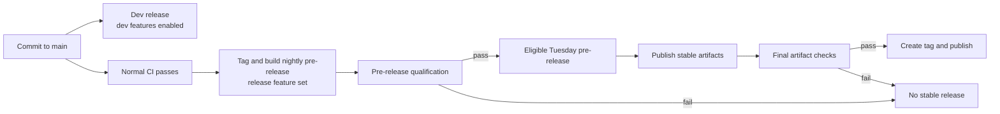

---
authors:
  - "@drew"
state: review
links:
  - https://github.com/NVIDIA/OpenShell/pull/2148
  - https://github.com/NVIDIA/OpenShell/pull/2695
---

# RFC 0014 - Alpha Exit Criteria and Stable Release Policy

## Summary

The goal of this RFC is to define OpenShell's exit from alpha and establish a
predictable release cycle for production users and ecosystem developers.

We propose

- Development releases for every commit to `main`, nightly pre-releases, and
  qualified stable releases every Tuesday.
- Stable and Experimental API maturity, compatibility, and versioning
  rules, and maintenance for the latest and N-1 minor release lines.
- A release qualification pipeline covering conformance, upgrades,
  API changes, and security reviews across the supported release matrix.

## Motivation

The goal is to exit alpha without slowing OpenShell's development. Releases
should remain frequent and automated, and Experimental APIs should be able to
evolve quickly enough to keep pace with the ecosystem. At the same time, users
need Stable interfaces they can confidently build on.

Starting with `0.1.0`, OpenShell provides both: a defined compatibility contract
for Stable interfaces and room to evolve Experimental APIs and features.
Releases are suitable for production use within the published support matrix
only after passing conformance, upgrade, compatibility, artifact, and security
checks.

## Proposal

### Release cadence

Starting with `0.1.0`, OpenShell publishes stable tagged releases intended for production use within
the published support matrix. Stable releases occur every Tuesday and increment
the patch version by default, for example `0.1.1` followed by `0.1.2`. A release
may instead increment the minor version when it introduces notable new features
or documented breaking changes. A stable tag is published only when there are
changes and every blocking qualification suite passes.

OpenShell publishes a development release for every commit to `main`. Each
development release identifies its source commit and artifact manifest, and the
floating `dev` alias points to the newest one. Development releases enable all
development compilation flags and features. They give feature authors, early
adopters, and integration owners a way to consume upcoming OpenShell changes
between stable releases. This also allows development of a large feature to
span multiple weeks behind a compile-time feature flag without including the
unfinished feature in the stable release track. Development releases have
passed normal CI, but have not passed release qualification and are not
intended for production use.

OpenShell builds a pre-release nightly for the next expected stable release
when `main` has changed and normal CI passes. After `0.1.1`, pre-releases are
numbered `0.1.2-pre.1`, `0.1.2-pre.2`, and so on. Features may land between
pre-releases. The first pre-release locks the version for that weekly release
train. Once a patch train starts, breaking changes that require a minor release
are staged for the following week; the train never switches from patch to minor.

Pre-releases give the automated release qualification and QA systems an
immutable artifact set to evaluate. They are also available to maintainers and
integration owners who need to validate the prospective stable release. A
pre-release uses the same release feature set as stable and may still fail
qualification; it is not intended for production use. Building one nightly
allows failures to be fixed and reevaluated before Tuesday.

| Release | Intended users | Contents and expectations |
| --- | --- | --- |
| Development | Feature authors, early adopters, and integration owners testing upcoming functionality | Published for every commit to `main`; enables development features; passes normal CI but not release qualification |
| Pre-release | Automated qualification, maintainers, and integration owners validating the next stable release | Built nightly from eligible `main`; uses the stable feature set; immutable but not yet qualified for production |
| Stable | Production users and downstream integrations that require the published compatibility and support contract | Published Tuesday from a pre-release that passed every blocking qualification suite |

### Project version and compatibility contract

Version `0.1.0` begins OpenShell's supported compatibility contract. For
the `0.x` series:

- Patch releases may contain bug fixes and additive, backward-compatible
  functionality. They do not intentionally break a stable interface.
- Minor releases may represent notable new features even when they remain
  backward-compatible. They may also contain documented breaking changes to
  stable interfaces, for example `0.1.x` to `0.2.0`.

The [release version selection supplement](release-version-selection.md)
defines how Conventional Commits select the next patch or minor release
pre-release.

### API and feature maturity

Public APIs are Stable by default. APIs that are expected to change frequently
must be explicitly designated Experimental. Protobuf packages encode the
designation in their version name. SDKs use language-appropriate package,
module, namespace, or symbol naming to expose the same designation.

| Maturity | Protobuf naming | SDK naming | Compatibility |
| --- | --- | --- | --- |
| Stable | `v1` or `v2` | Default Stable package, module, namespace, or symbol | Backward-compatible across patch releases; may change in a minor release with notice and migration guidance |
| Experimental | `v1experimental` | Language-specific Experimental package, module, namespace, or symbol | May change or be removed in a patch release without notice |

Every API and feature is Stable or Experimental, regardless of whether it
appears in stable, pre-release, or development artifacts. Each SDK must
document its language-specific naming convention, and Experimental interfaces
must not appear to be Stable.

Experimental APIs are intended for rapid iteration and may change in place
without a compatibility guarantee. Graduation adds a Stable `v1` package
instead of renaming the Experimental package in place.

Unreleased features use named compile-time flags such as `unstable-<feature>`,
collected under a `dev` compilation flag. Development releases enable them; stable
releases and pre-releases exclude them from service binaries, the CLI,
configuration, and documentation. For now, SDK distributions may include their
generated types and client methods when the SDK naming convention communicates
their maturity.

### Breaking changes and API versioning

A breaking change to a Stable API or other stable OpenShell surface requires a
minor release with notice and migration guidance. This applies to Protobuf,
SDK, CLI, configuration, policy, Helm, and state interfaces. A breaking
Experimental API change may ship in a patch release without notice when it does
not break a Stable interface.

Breaking-change detection runs during code review and again during pre-release
qualification. Stable protobuf packages use Buf's `FILE` rules
against the latest stable baseline and any additional supported baseline needed
for the N-1 maintenance promise. Language-specific API checks or agent review
skills cover the public SDKs.

The following examples illustrate how these rules affect a pre-release:

| Example | Concrete change | Release treatment |
| --- | --- | --- |
| Breaking Stable Protobuf contract | `string policy = 7` to `PolicyReference policy = 7` | Blocks a patch release and requires a minor OpenShell release. |
| Breaking Experimental Python SDK method | `create_sandbox(timeout=30)` to `create_sandbox(deadline=...)` | May ship in a patch release without notice. |
| Breaking stable policy document | `endpoints:` to `destinations:` | Blocks a patch release unless both fields remain supported. |
| Breaking stable CLI contract | `--policy policy.yaml` to `--policy-file policy.yaml` | Requires retaining the old flag as an alias or shipping a minor release. |

### Pre-release qualification and stable publication

The release system separates pre-release creation, qualification, and stable
publication:

Every pre-release is tagged before qualification and produces a manifest with
its version, source commit, build inputs, artifact digests, SBOM, provenance,
and qualification results. Qualification exercises those artifacts rather than
a substitute source build. Pre-releases are stored in artifact storage instead
of published as GitHub Releases, following the
[Bazel rolling release model](https://bazel.build/release/rolling). Any change
creates a new pre-release.

Release qualification consists of four suites defined in the
[release qualification supplement](release-qualification.md):

- **Conformance** runs across supported driver and gateway configurations. It
  verifies core sandbox behavior, policy enforcement, and extension contracts.
- **Upgrade** runs once per supported installation package and verifies its
  upgrade path, state migration, post-upgrade health, and rollback where
  promised.
- **Breaking API change review** runs once per pre-release and compares stable
  protobuf and SDK interfaces with every applicable compatibility baseline.
- **Security review** runs once per pre-release and verifies security scan
  results, reviews changes to security-sensitive boundaries, and confirms that
  every finding has the required disposition.

The initial release targets are defined in the [build matrix](build-matrix.md),
and blocking coverage is defined in the
[release qualification supplement](release-qualification.md).

The weekly release tags the newest eligible pre-release commit with the next
stable version and publishes the stable artifacts.

### Maintenance and backports

OpenShell maintains two release lines: the latest minor and N-1. Support
applies to the newest patch on each line. Users on an older patch update to the
new maintenance patch rather than receiving a separate fix for every historical
patch.

Maintenance releases contain critical reliability fixes and security fixes.
They do not backport features. A fix is developed on the appropriate primary
branch and backported to a `release/<major>.<minor>` branch when the older line
is affected. Each backport passes the compatibility, regression, packaging,
and supported upgrade qualification appropriate to that line.

For example, if `0.3.1` is current and a vulnerability also affects the 0.2
line, OpenShell publishes the next available `0.2.x` patch from the maintained
0.2 branch. A security release may occur immediately rather than waiting for
the next Tuesday release.

## Implementation plan

1. **Keep per-commit dev releases and build 0.1.0 pre-releases nightly.** Build
   every commit to `main` with all development features, and publish sequential
   `0.1.0-pre.N` artifacts with the release feature set leading to 0.1.0.
2. **Make the necessary breaking API changes.** Use the pre-0.1.0 window to
   finalize Stable interfaces, move evolving APIs to Experimental packages,
   and establish the compatibility baseline.
3. **Build qualification tests and release machinery.** Automate compatibility
   detection, conformance, upgrade, breaking API change review, security
   qualification, artifact validation, and release publication gates.
4. **Release 0.1.0.** Select a qualified pre-release, publish the stable
   artifacts and support guidance, and begin the weekly release cadence.
