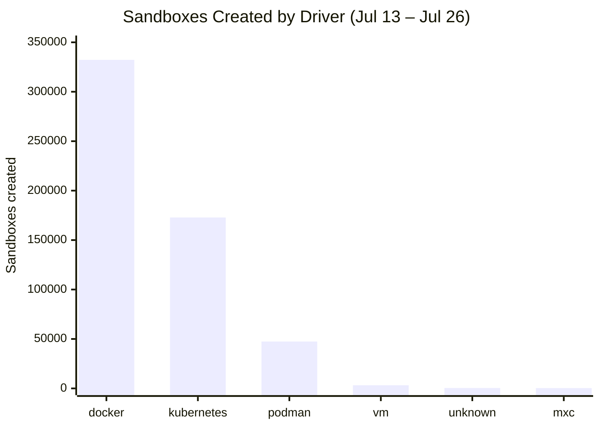
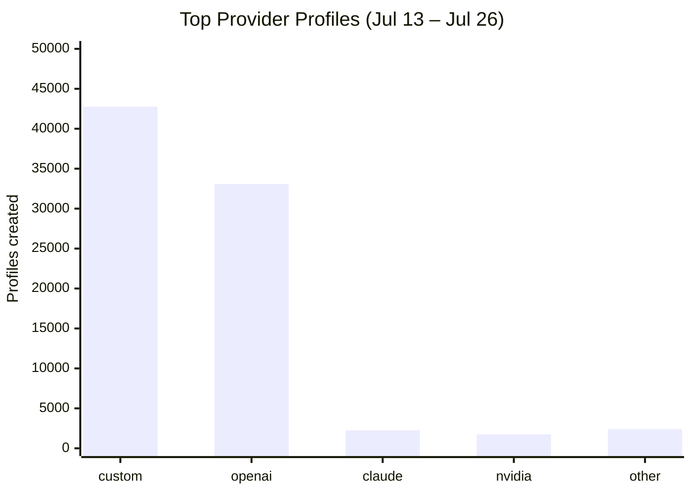
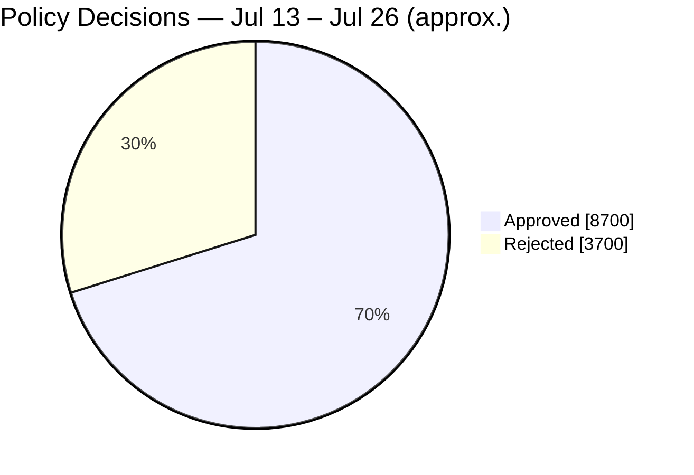

# OpenShell Telemetry — July 13 – July 26, 2026

[← All reports](README.md)

Metrics below cover this two-week window, compared with the prior period (June 24 – July 8, 2026). Numbers are aggregate counts only — see the [Telemetry section](../README.md#telemetry) of the main README for what's collected and how to opt out.

| Metric | This period | Prior period | Change |
|---|---:|---:|---:|
| Sandboxes created | 556,370 | 269,220 | +106.7% |
| Sandboxes deleted | 421,946 | 247,727 | +70.3% |
| Sandbox creation failures | 100,246 | 5,345 | +1,775.5% |
| Actions denied | 3,505,237 | 2,323,468 | +50.9% |
| Network activity events | 34,946,280 | 29,935,431 | +16.7% |

The creation failure rate was ~18% this period (100,246 failures against 556,370 creates), up from ~2% in the prior period. Docker was the most-used driver at 332,238, ahead of Kubernetes (172,834).

**Sandbox drivers.** Docker leads at 332,238, then Kubernetes (172,834) and Podman (47,374). The long tail: VM (3,198), unknown (399), and MXC (327).

**Where sandboxes are created.** The United States leads by a wide margin, followed by Israel, Japan, India, Singapore, Hong Kong, China, Germany, Thailand, and Sweden.

**Providers.** `custom` profiles lead at 42,758, then `openai` (33,074), claude (2,261), nvidia (1,744), github (784), anthropic (660), opencode (624), gitlab (284), codex (38), and copilot (18).

**Policy.** Roughly 70% of policy decisions were approved this period (~8.7k approved vs ~3.7k rejected). Of denied sandbox connections, ~98% fell under the "Connect Policy" deny group.

