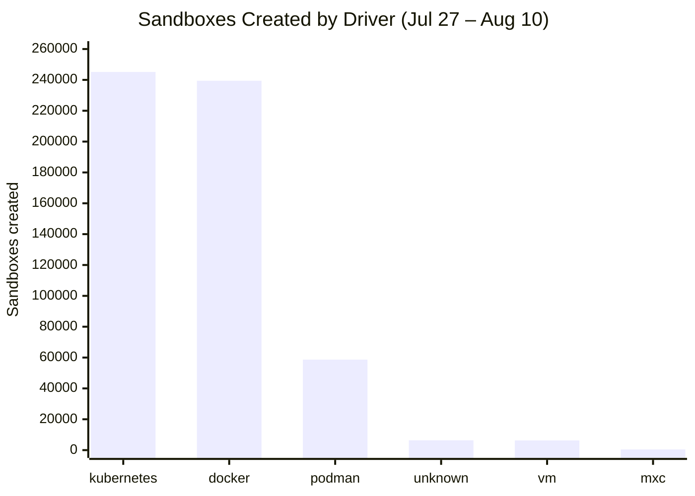
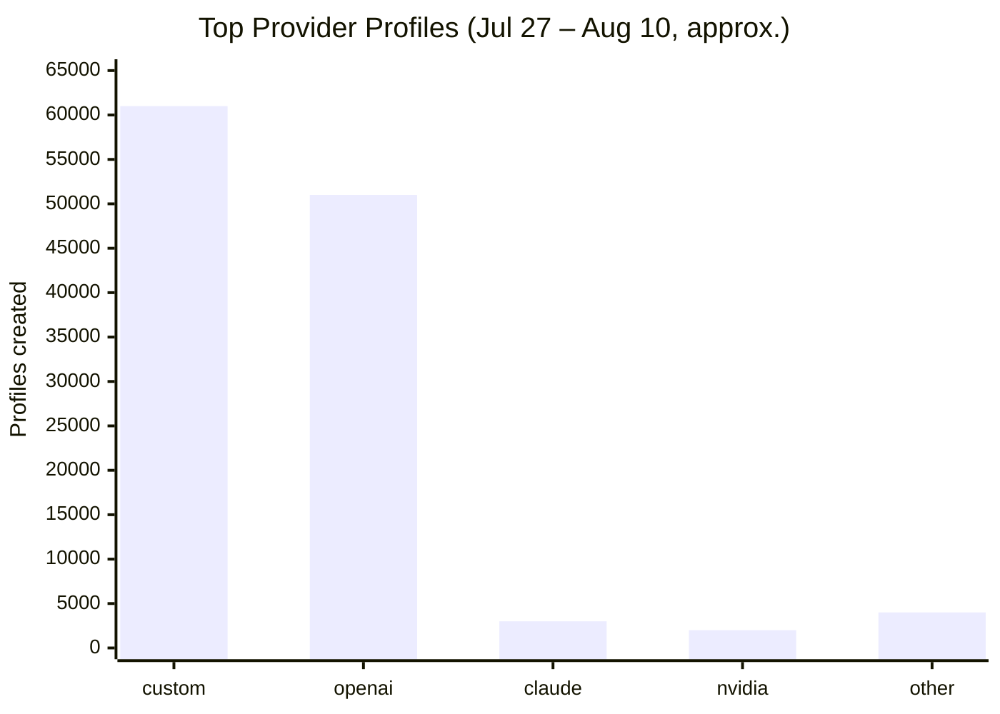
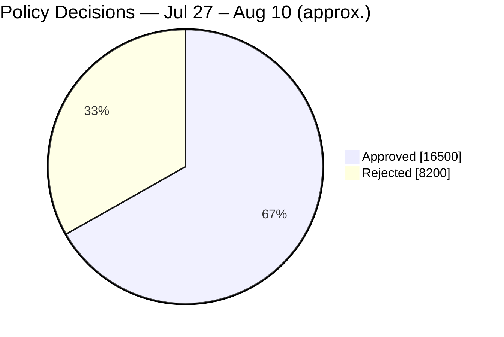

# OpenShell Telemetry — July 27 – August 10, 2026

[← All reports](README.md)

Metrics below cover this two-week window, compared with the prior period (July 13 – July 26, 2026). Numbers are aggregate counts only — see the [Telemetry section](../README.md#telemetry) of the main README for what's collected and how to opt out.

| Metric | This period | Prior period | Change |
|---|---:|---:|---:|
| Sandboxes created | 556,389 | 556,370 | +0.0% |
| Sandboxes deleted | 457,086 | 421,946 | +8.3% |
| Sandbox creation failures | 66,511 | 100,246 | -33.7% |
| Actions denied | 4,220,436 | 3,505,237 | +20.4% |
| Network activity events | 27,077,441 | 34,946,280 | -22.5% |

The creation failure rate was ~12% this period (66,511 failures against 556,389 creates), down from ~18% in the prior period. Kubernetes (245,144) overtook Docker (239,444) as the most-used sandbox driver.

**Sandbox drivers.** Kubernetes leads at 245,144, just ahead of Docker (239,444), with Podman third at 58,657. The long tail: unknown (6,386), VM (6,267), MXC (461), apple-container (23), and LXD (7).

**Where sandboxes are created.** The United States again leads by a wide margin, followed by India, Germany, China, Poland, Japan, the United Kingdom, Israel, Hong Kong, and Denmark.

**Providers.** `custom` profiles lead (~61k), then `openai` (~51k), with claude, nvidia, github, anthropic, gitlab, opencode, codex, and copilot trailing.

**Policy.** Roughly 67% of policy decisions were approved this period (~16.5k approved vs ~8.2k rejected). Of denied sandbox connections, ~93% fell under the "Connect Policy" deny group, with "Bypass" denials near zero.

